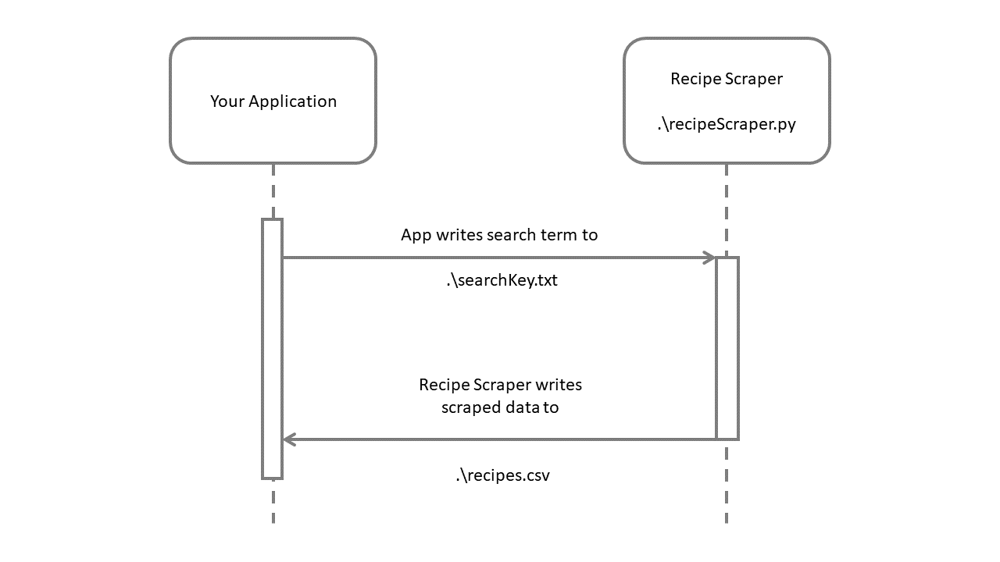

# Recipe Scraper

A web scraping tool to collect recipe links from SimplyRecipes.com

## Description

Using Selenium Webdriver, this program scrapes recipes from SimplyRecipes.com using a searchKey read from a file, searchKey.txt. For each recipe found on the website, a link to the recipe, the name of the recipe, and a link to an image of the recipe are collected. The scraped data is written to a csv file for use by other applications. The program is intended to be installed locally and used server side to support web applications that require recipe search functionality. This program was developed as part of a term project in CS 361 Software Engineering I at Oregon State University, Fall 2023.

## Getting Started

### Dependencies

Developed using:
* Windows 11 Home
* Google Chrome
* Python 3.11.4
* Selenium 4.15.2
* Webdriver-Manager 4.0.1

### Installing

* Download recipeScraper.py where it is to be run
* Install Selenium and Webdriver Manager globally or in a virtual environment

```
pip install selenium
```
```
pip install webdriver-manager
```
 
* Note that the program will modify files 'searchFile.txt' and 'recipes.csv' while running

### Executing program

* The process is executed using the following

```
python recipeScraper.py
```

* TO REQUEST DATA write a search term, e.g. tomato, to a searchFile.txt located in the same folder as recipeScraper.py
* The program will execute, open a chrome web browser, scrape, and reply to the console that "{some number} recipes were found. The search results have been written to ./recipes.csv"
* TO RECEIVE DATA look for ./recipes.csv



## Help

Contact Kenneth Stout at stoutk@oregonstate.edu for help

## Authors

Contributors names and contact info

* Kenneth Stout - stoutk@oregonstate.edu, kenneth.stout on Discord
* Kristen Haynes

## Version History

* 0.1
    * Initial Release

## Acknowledgments

Useful links and references
* ![Helpful README Template]https://gist.github.com/DomPizzie/7a5ff55ffa9081f2de27c315f5018afc
* ![Automation Step by Step Selenium Python Ep. 1]https://www.youtube.com/watch?v=pcGqraAgMto
* ![Automation Step by Step Selenium Python Ep. 2]https://www.youtube.com/watch?v=y8CiSwDnQSU
* ![Galina Blokh's Python Selenium Guide]https://medium.com/analytics-vidhya/python-selenium-web-scraping-in-eight-steps-7d33b263f399
* ![Checking if an element exists, try/except]https://stackoverflow.com/questions/9567069/checking-if-an-element-exists-with-python-selenium
* ![Stale element handling, try/except]https://www.softwaretestingmaterial.com/stale-element-reference-exception-selenium-webdriver/
* ![Webdriver-Manager PyPi]https://pypi.org/project/webdriver-manager/
* ![Selenium PyPi]https://pypi.org/project/selenium/
